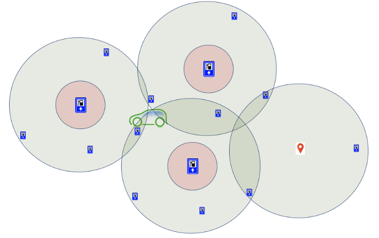

# Charge station based routing


**`Charge Station based Routing` means treat `charge stations` as `nodes` in graph, `weight` between `nearby` or `reachable` charge stations as `edges`, and then apply classic routing algorithm, such as `Dijkstra`, to calculate best solution**.


## General idea

If `Orig` and `Dest` has some distance in between, let's say needs at least one charge time.
We could find all charge stations which could be reached for start point and all charge stations are needed to reach destination, if there are overlap in between, then we could end up with single charge station, otherwise, calculate the best route based on charge station network, node is charge station, edge is reachable charge station for each charge station.



If we pro-process all charge stations in the graph and record the `connectivity` for each charge station, which means for each single charge station, we could retrieve  **all reachable charge stations sorted by distance or energy needed**, then we could calculate optimal result based on classic algorithm.


## Design

### Pre-process work flow

```
Telenav's Database(postGIS) 
       -> csv 
               -> adjust column name 
                       -> convert csv to json 
                                 -> decoding json
```
More information [#237](https://github.com/Telenav/osrm-backend/issues/237) 


